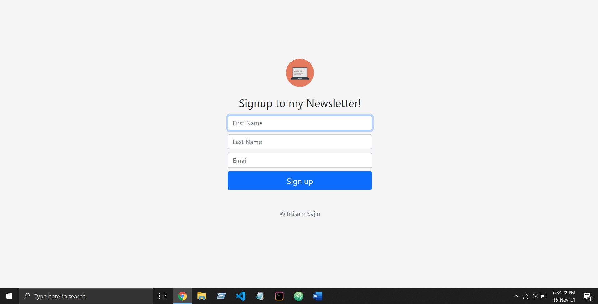
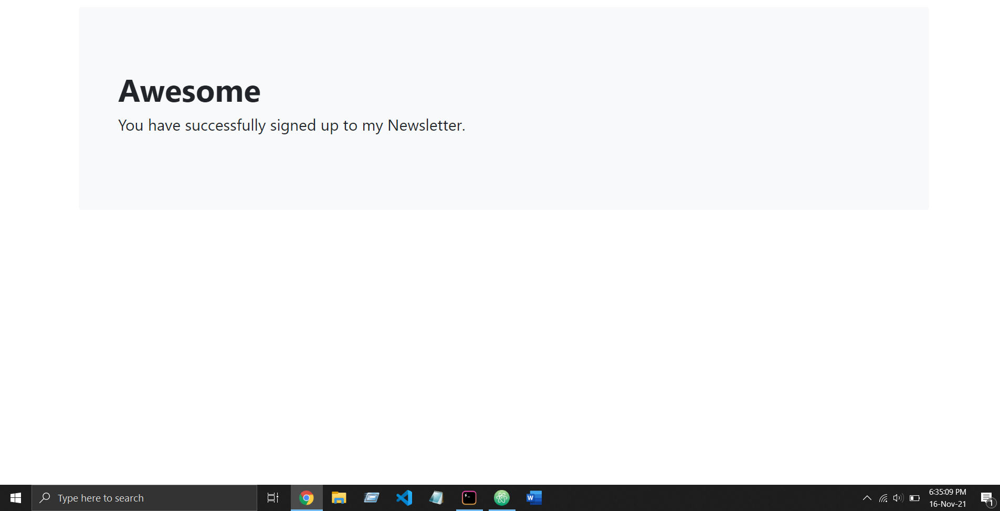
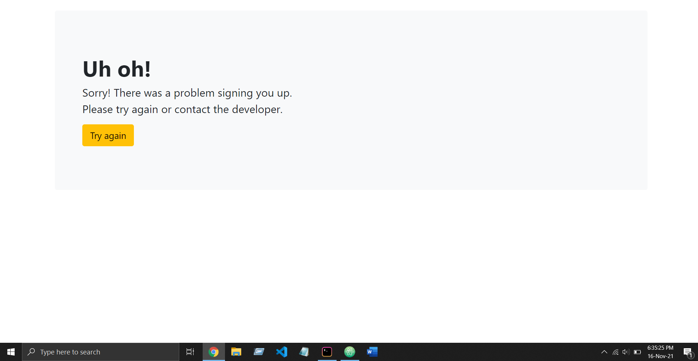
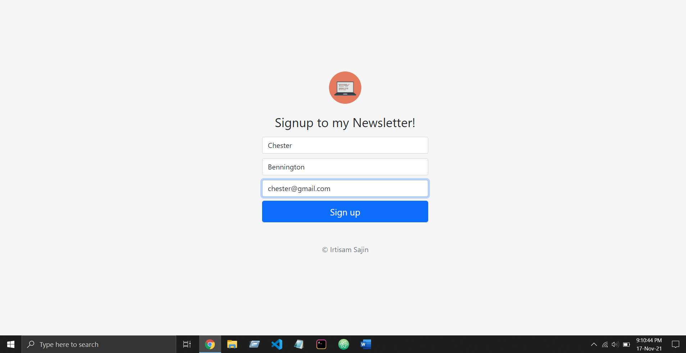
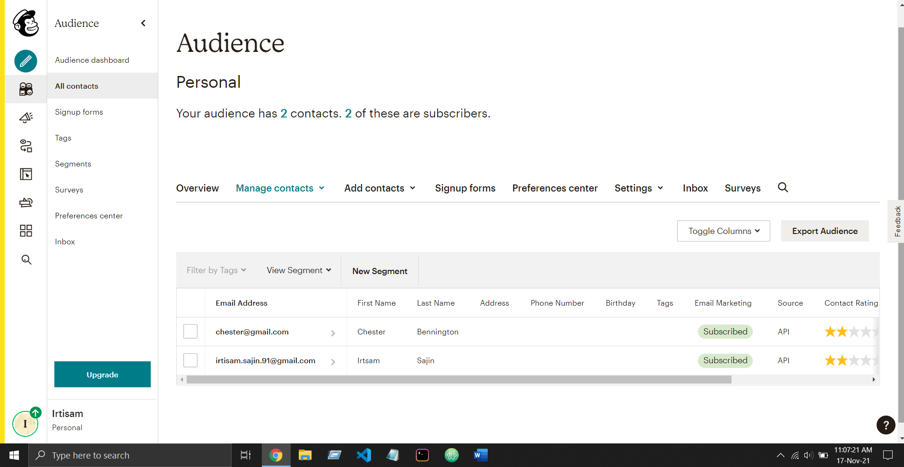

# Newsletter Signup Page

<h4>
  A backend Node.js project that uses Mailchimp to store the email addresses of the users who want to subscribe to the Newsletter. The frontend is built using Bootstrap "Sign-in" template.
  The backend uses Node.js with Express and NPM. NPM packages that have been used are: express, body-parser, https and request. The project has been hosted on Heroku: <a href="https://enigmatic-castle-41456.herokuapp.com/">Newsletter</a>
</h4>

<h4>
  Below are some screenshots of the project:
  </h4> 
  <h4>1. Homepage</h4>
   

   <h4>2. Success page loads up when the user is successfully subscribed to the Newsletter</h4>
   

   <h4>3. Failure page loads up when something goes wrong. The "Try Again" button redirects to the Homepage</h4>
   

 <h4>4. User can subscribe by filling out the form</h4>
   

 <h4>5. The Mailchimp dashboard which shows all the users who have subscribed along with their names and email id</h4>
   
